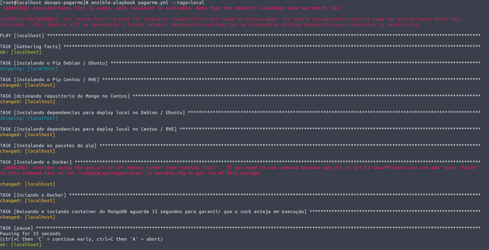
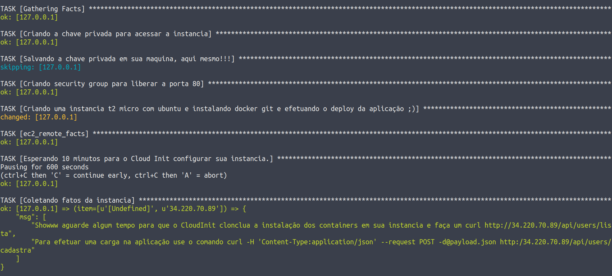
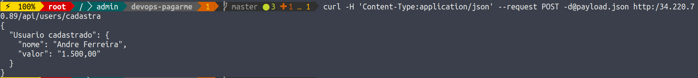

# Deploy Cobrar-me


Esta é uma simples API desenvolvida em Flask que utiliza os métodos GET e POST, possui persistência de dados usando mongodb. Ela se chama Cobrar-me e serve para armazenar nomes e valores devidos.

## Requisitos mínimos. 

É necessario o Ansible instalado e configurado a troca de chaves diretamente para o localhost da mesma maquina que ira executar a playbook casso nao queira efetuar a troca de chave use o parametro --ask-pass.

O restante das dependências a playbook faz a instalação automaticamente. 

# Executando a playbook deploy local 

Esta playbook utiliza tags para marcar as ações desejadas, para executar o deploy localmente execute o comando abaixo:
```
ansible-playbook pagarme.yml –tags=local
```

### Testando a aplicação localmente
```
curl http:/localhost/api/users/lista
```



### Solucionando problemas

Durante os teste algumas maquinas com sistema operacional ubuntu desktop 18.x apresentaram problemas de “No module named ssl_match_hostname ***”. 

O erro ocorre ao tentar usar o Docker.py e para solucinar nas maquinas em que testei bastou copiar o conteúdo de ssl_match_hostname para dentro de backports no diretorio do python com o comando abaixo: 
``` 
cp -r /usr/local/lib/python2.7/dist-packages/backports/ssl_match_hostname/ /usr/lib/python2.7/dist-packages/backports 
```

# Executando a playbook deploy AWS

## Configurando o Boto

Antes de qualquer coisa execute a playbook com a tag depends para que o Ansible instale todas as dependências necessárias, inclusive o Boto.
```
ansible-playbook pagarme.yml --tags=depends
```


*O diretório .aws deve estar na home do usuário que ira executar a playbook, exemplo root ou o seu próprio usuário dependendo de sua configuração.

*Não se esqueça de trocar os valores do segredo e da chave de sua conta no comando abaixo.
```
mkdir -p ~/.aws/
echo -e "[default]\\naws_access_key_id = COLOQUE-SUA-ACCESS-KEY-AQUI\\naws_secret_access_key = COLOQUE-SUA-SECRET-ACCESS-KEY-QUI" > ~/.aws/credentials
```
Configure a região (em meu caso eu escolhi Oregon).

## Executando a playbook e testando aplicação

Antes de executar a playbook altere a variavel na linha 6 com a Subnet_ID correspondente de sua rede na AWS e na linha 7 troque a região pela mesma região configurada no boto.
```
ansible-playbook pagarme.yml --tags=aws
```



Para testar a aplicação efetue o comando abaixo.
```
curl -H 'Content-Type:application/json' --request POST -d@payload.json http:/IPDAMAQUINA/api/users/cadastra
curl http:/IPDAMAQUINA/api/users/lista
```

